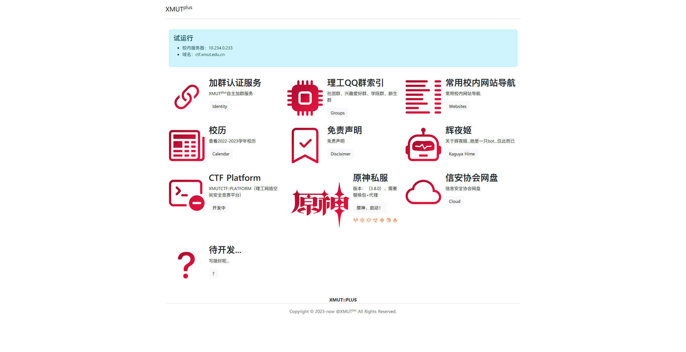
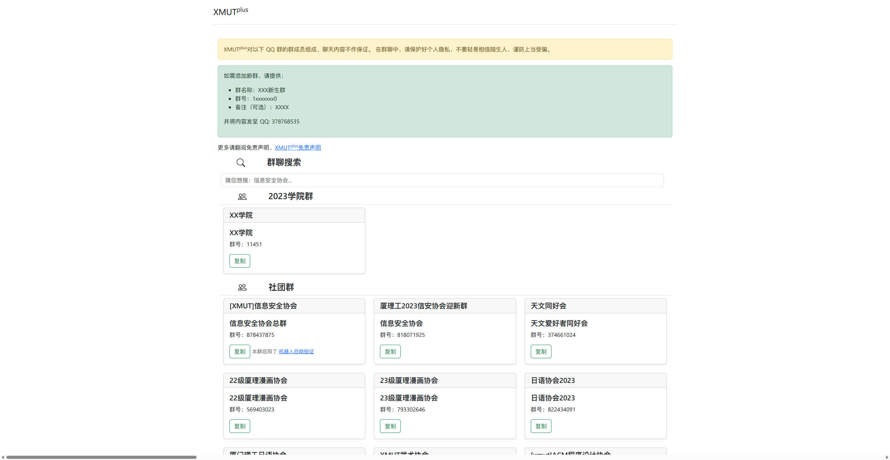

<div align="center">
	<h3>xmutplus</h3>
	<hr />
</div>
 厦门理工大学 校内常用资源引导站

> 校内访问网址：
>
> - http://src.xmut.edu.cn
> - http://ctf.xmut.edu.cn/plus

题外话：原本是想写一个类似上交大SJUT-Plus团队的统一认证功能，详见：[SJTU-Plus/sjtu-plus: Backend of SJTU-Plus (github.com)](https://github.com/sjtu-plus/sjtu-plus) ，后来由于种种原因没能申请到OAuth的权限，所以就咕咕了，不然写出来的话可以秒掉不少打广告的（真的很烦内）

这玩意本质上就是个增删改查

后端主要用Django进行开发，前端用BootStrap v5，在暑假上班期间写的，~~**事实告诉我们，真正的为爱发电，一点屁用都没有**~~

```
base58==2.1.1
bs4==0.0.1
Django==4.2.4
fake-useragent==1.2.1
pigar==2.1.1
pycryptodome==3.18.0
python-dotenv==1.0.0
requests==2.31.0
```

#### 一些截图





